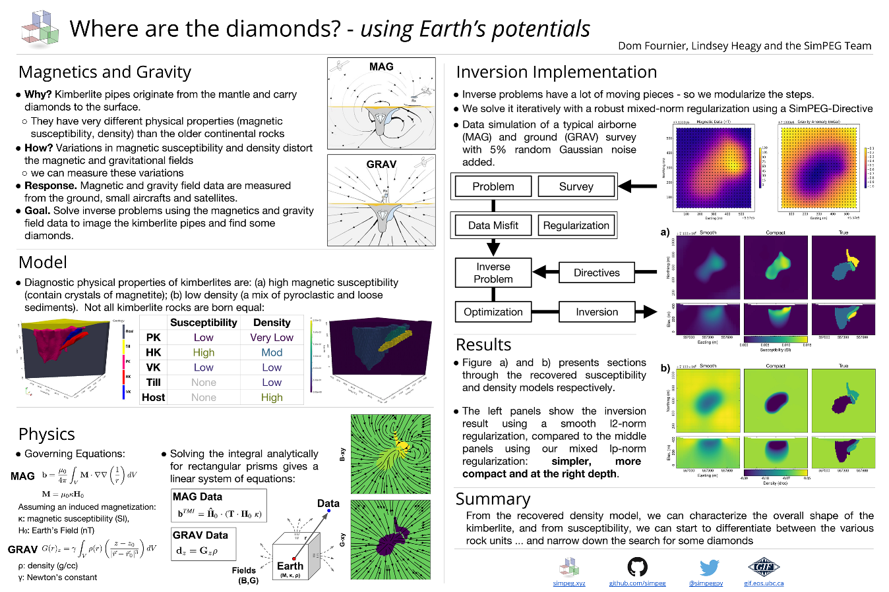

.. _PF_MAG:

Potential Fields (Magnetics)
============================

.. topic:: Purpose

    In this tutorial, we demonstrate how to invert magnetic field data in 3D
    using SimPEG.PF. It simulates a geophysical experiment over a synthetic
    kimberlite pipe model. The chosen geological model intends to replicate
    the Tli Kwi Cho kimberlite deposit, NWT. Using SimPEG Directives, we
    implement a sparse regularization function and recover both a smooth and a
    compact susceptibility model, which can used to infer geological
    information at depth. The same example was presented as a poster_ at Scipy
    2016. There is also a notebook available for download

..here_.

.. _poster: https://drive.google.com/open?id=0B-8Bv7qmQs23NHRTcXZ5WXVLdkE

.._here:  https://github.com/simpeg/tutorials/blob/PF_vDF/notebooks/Magnetics%20over%20TKC%20Final.ipynb

Setup
-----

We begin this story with some physics background. We need to establish the
connection between rocks magnetic properties and the associated geophysical
experiment. Maxwell's equations for a static electric field and in the absence
of free-currents can be written as:

:math:`\nabla \cdot \mathbf{B} = 0 \\ \nabla \times \mathbf{H} = 0`

where :math:`\mathbf{B}` and :math:`\mathbf{H}` correspond to the magnetic
flux density and magnetic field respectively. Both quantities are related by:

:math:`\mathbf{B} = \mu \mathbf{H} \\ \mu = \mu_0 ( 1 + \kappa )\;,`

where :math:`\mu` is the magnetic permeability. In free-space, both
:math:`\mathbf{B}` and :math:`\mathbf{H}` are linearly related by the magnetic
permealitity of free-space :math:`\mu_0`. In matter however, the magnetic flux
can be increased proportionally on how easily magnetic material gets
polarized, quantified by the magnetic susceptibility :math:`\kappa`. In a
macroscopic point of view, the magnetic property of matter are generally
described in terms of magnetization per unit volume such that:

:math:`\mathbf{M} = \kappa \mathbf{H_s + H_0} + \mathbf{M_r}\;,`

where :math:`\mathbf{M}` can be oriented in any specific direction due to
secondary local fields (:math:`\mathbf{H_s}`) and/or due to permanent dipole
moments (:math:`\mathbf{M_r}`). For simplicity we will here assume a purely
induced response due to the Earth's :math:`\mathbf{H_0}`. Using a few vector
identities, we can re-write the magnetic field due to magnetized material in
terms of a scalar potential:

:math:`\phi = \frac{1}{4\pi}  \int_{V}    \nabla \left(\frac{1}{r}\right) \cdot \mathbf{H}_0 \kappa  \; dV\;,`

where :math:`r` defines the relative position between an observer and the
magnetic source. Taking the divergence of this potential yields:

:math:`\mathbf{b} = \frac{\mu_0}{4\pi}  \int_{V}  \nabla \nabla \left(\frac{1}{r}\right) \cdot \mathbf{H}_0 \kappa \; dV\;.`

Great, we have a general expression relating any secondary magnetic flux due to
magnetic material

Forward Problem
---------------

Assuming a purely induced response, we can solve the integral analytically. As
derived by Sharma (1966), the integral can be evaluated for rectangular prisms
such that:

:math:`\mathbf{b} =  \mathbf{T} \cdot \mathbf{H}_0 \; \kappa\;.`

Where the tensor matrix :math:`\bf{T}` relates the vector magnetization
:math:`\mathbf{M}` inside a single cell to the components of the field
:math:`\mathbf{b}` observed at a given location:

:math:`\mathbf{T} = \begin{pmatrix} T_{xx} & T_{xy} & T_{xz}    \\ T_{yx} &
T_{yy} & T_{yz}    \\ T_{zx} & T_{zy} & T_{zz} \end{pmatrix}\;.`

In general, we discretize the earth into a collection of cells, each
contributing to the magnetic data such that giving rise to a large and dense
linear system of the form:

:math:`\mathbf{b} = \sum_{j=1}^{nc} \mathbf{T}_j \cdot \mathbf{H}_0 \; \kappa_j\;.`

In most geophysical surveys, we are not collecting all three components, but
rather the magnitude of the field, or *Total Magnetic Intensity* (TMI) data.
Because the inducing field is really large, we will assume that the anomalous
fields are parallel to :math:`H_0`:

:math:`d^{TMI}  = \mathbf{\hat H}_0 \cdot \mathbf{b}\;.`

We then end up with a much smaller system:

:math:`d^{TMI} = \mathbf{F}\; \boldsymbol{\kappa}\;,`

where :math:`\mathbf{F} \in \mathbb{R}^{nd \times nc}` is our *forward*
operator and :math:`\kappa` is the physical property describing the Earth.

Getting started
^^^^^^^^^^^^^^^

In order to define a geophysical experiment we need set several important
parameters, such as a mesh, data location, inversion parameters and so on.
While we could set all of those parameters manually, SimPEG.PF gives the
option to work with an input file, capturing all the necessary information to
run the inversion. In preparation for this synthetic example, we put together
all necessary files and added them to a working directory. The input file can
then be loaded and easily accessed through the Driver class:

.. exec::

    import SimPEG
    import SimPEG.PF as PF
    from SimPEG.Utils import io_utils
    import os #hide
    import sys #hide
    psep = os.path.sep #hide

    # Start by downloading files from the remote repository
    url = 'https://storage.googleapis.com/simpeg/tkc_synthetic/potential_fields/'
    cloudfiles = ['MagData.obs', 'Mesh.msh',
                  'Initm.sus', 'SimPEG_PF_Input.inp']

    basePath = io_utils.remoteDownload(url, cloudfiles) #hide
    input_file = basePath + 'SimPEG_PF_Input.inp' #hide
    driver = PF.MagneticsDriver.MagneticsDriver_Inv(input_file)

    # Objects loaded from the input file are then accessible like this
    mesh = driver.mesh
    initm = driver.m0

The input file looks like this:

====    ==============   ===================================================================================
Line    Input            Description
====    ==============   ===================================================================================
1       Mesh.msh         Mesh file*
2       Data.obs         Data file*
3       VALUE -100       Topography file* | null (all included)
4       FILE Initm.mod   Starting model* | VALUE ##
5       VALUE 0          Reference model* | VALUE ##
6       DEFAULT          Magnetization file* | DEFAULT
7       DEFAULT          Cell weight file* | DEFAULT
8       DEFAULT          Target Chi factor VALUE | DEFAULT (1)
9       DEFAULT          Scaling parameters for regularization (:math:`\alpha_s,\alpha_x,\alpha_y,\alpha_z`)
10      VALUE 0 1        Lower and upper bound values
11      VALUE 0 1 1 1    Lp-norms applied on model and model gradients (:math:`p,q_x,q_y,q_z`)
12      DEFAULT          Treshold parameter for the norms (:math:`\epsilon_p,\epsilon_q`) | DEFAULT
Note                     * UBC file format
====    ==============   ===================================================================================

We will use each elements later, but for now, this how the inversion
is initiated.

Model and Mapping
^^^^^^^^^^^^^^^^^

Since we have already loaded the model in a rectangular mesh, we can plot it
with SimPEG's built-in functions.

.. plot::

    import SimPEG #hide
    import SimPEG.PF as PF #hide
    import os #hide
    import sys #hide
    psep = os.path.sep #hide
    basePath = os.getcwd() + psep + ".." + psep  + ".." + psep + 'SimPEGtemp'+ psep #hide
    input_file = basePath + 'SimPEG_PF_Input.inp' #hide
    driver = PF.MagneticsDriver.MagneticsDriver_Inv(input_file) #hide
    mesh = driver.mesh #hide
    initm = driver.m0 #hide

    initm[initm==-100] = np.nan

    # Create a figure and plot sections
    fig, ax1 = plt.figure(), plt.subplot(1,2,1)
    mesh.plotSlice(initm, ax = ax1, normal='Z', ind=18, clim = (0,0.02), pcolorOpts={'cmap':'viridis'})
    plt.gca().set_aspect('equal')
    plt.title('Z: '+str(mesh.vectorCCz[18]) + " m")

    ax2 = plt.subplot(1,2,2)
    mesh.plotSlice(initm, ax = ax2, normal='Y', ind=16, clim = (0,0.02), pcolorOpts={'cmap':'viridis'})
    plt.gca().set_aspect('equal')
    plt.title('Y: '+str(mesh.vectorCCy[16])+' m')

    plt.show()

Notice that some of the cells in the model are air and show as white. The code
will detected the air cells from the VALUE specified on line 3 of the input
file. These cells are ignored by the code. Alternatively, the user can input a
topography file or an active model specifying the status of each cells
(0:inactive, 1:active-dynamic, -1:active-static).

Data
^^^^

Great, now that we have a mesh and a model, we only need to specify a survey
(i.e. where is the data). Once again, an observation file is provided, as
specified on Line 2 of the input file. We can now forward model some magnetic
data above the synthetic kimberlite.

.. exec::

    from SimPEG import Maps #hide
    import SimPEG.PF as PF #hide
    import os #hide
    import sys #hide
    import numpy as np #hide
    psep = os.path.sep #hide
    basePath = os.getcwd() + psep + 'SimPEGtemp'+ psep #hide
    input_file = basePath + 'SimPEG_PF_Input.inp' #hide
    driver = PF.MagneticsDriver.MagneticsDriver_Inv(input_file) #hide
    mesh = driver.mesh #hide
    # Get the survey
    survey = driver.survey

    # Get the active cells (below topography)
    actv = driver.activeCells
    # Create mapping to come back from the reduce space later
    idenMap = Maps.IdentityMap(nP=len(actv))
    initm = driver.m0 #hide

    # Now that we have a model and a survey we can build the linear system ...
    # (use the argument forwardOnly=True to avoid storing the dense forward matrix)
    prob = PF.Magnetics.MagneticIntegral(mesh, mapping=idenMap, actInd=actv, forwardOnly=True, rtype = 'tmi')

    # Pair the survey and problem (data and model space)
    survey.pair(prob)

    # Forward operators and data are calculated here (wait for it!)
    d = prob.fields(initm)

    # Add noise to the data and assign uncertainties
    survey.dobs = d + np.random.randn(len(d)) # We add some random Gaussian noise (1 nT)
    survey.std = np.ones(len(d))*1. # Assign flat uncertainties (1 nT)

    # Then we can quickly plot the data with the build-in function
    PF.Magnetics.plot_obs_2D(survey.srcField.rxList[0].locs,d=survey.dobs ,varstr='Mag Obs')

.. plot::

    import SimPEG.PF as PF #hide
    import os #hide
    import sys #hide
    psep = os.path.sep #hide
    basePath = os.getcwd() + psep + ".." + psep  + ".." + psep + 'SimPEGtemp'+ psep #hide
    input_file = basePath + 'SimPEG_PF_Input.inp' #hide
    driver = PF.MagneticsDriver.MagneticsDriver_Inv(input_file) #hide

    # Get the survey
    survey = driver.survey

    # Then we can plot with the build-in function
    PF.Magnetics.plot_obs_2D(survey.srcField.rxList[0].locs,d=survey.dobs ,varstr='Mag Obs')
    plt.show()

Inverse Problem
---------------

We have generated synthetic data, we now what to see if we can solve the
inverse problem. Using the usual formulation, we seek a model that can
reproduce the data, let’s say a least-squares measure of the form:

:math:`\phi_d =\|\mathbf{W}_d \left( \mathbf{F}\;\mathbf{m} - \mathbf{d}^{obs} \right)\|_2^2\;,`

where :math:`\mathbf{W}_d` are estimated data uncertainties
The inverse problem is hard because we don’t have great data coverage, and the
Earth is big, and there is usually noise in the data. So we need to add
something to regularize it. The simplest way to do it is to penalize solutions
that won’t make sense geologically, for example to assume that the model is
*small* and *smooth*. Most inversion codes use the l2-norm measure such that:

:math:`\phi_m = {\| \mathbf{W}_s \;( \mathbf{m - m^{ref}})\|}^2_2  + \sum_{i = x,y,z}  {\|   \mathbf{W}_i  \; \mathbf{G}_i \; \mathbf{m}\|}^2_2`

where :math:`m^{ref}` is any a priori knowledge that we might have about the
solution and :math:`\mathbf{G}_x, \mathbf{G}_y, \mathbf{G}_z` are finite
difference operators measuring the model spatial gradients along orthogonal
directions. In a purely *unconstrained* case, :math:`m^{ref}` is usually equal
to some background value (i.e. zero susceptibility).
The full objective function to be minimized can be written as:

:math:`\phi (m) =  \phi_d + \beta \phi_m`

which will yield our usual function that minimize the data error and model
structure. The trade-off parameter :math:`\beta` is adjusted in order to get a
*good* balance between data misfit and model

We propose a fancier regularization function that can allow to recover *sparse* and *blocky* solutions.
Starting with the well known Ekblom norm:

:math:`\phi_m =  \sum_{i=1}^{nc} {(x_i^2 + \epsilon^2)}^{p/2}`

where :math:`x_i` denotes some function of the model parameter, and :math:`\epsilon` is a small value to avoid singularity as :math:`m\rightarrow0`.

For p=2, we get the usual least-squares measure and we recover the
regularization presented above. For :math:`p \leq 1`, the function becomes
non-linear which requires some tweaking. We can linearize the function by
updating the penality function iteratively, commonly known as an Iterative Re-
weighted Least-Squares (IRLS) method. The regularization function becomes:

:math:`\phi_m^{(k)} =  \frac{1}{2}\sum_{i=1}^{nc} r_i \; x_i^2`

where we added the superscript :math:`\square^{(k)}` to denote the IRLS iterations.
The weights :math:`r(x)` are computed from model values obtained at a previous
iteration such that:

:math:`{r}_i  ={\Big( {({x_i}^{(k-1)})}^{2} + \epsilon^2
\Big)}^{p/2 - 1}`

where :math:`{r}(x) \in \mathbb{R}^{nc}`.

In matrix form, our objective function simply becomes:

:math:`\phi(m) =   \|\mathbf{W}_d \left( \mathbf{F}\;\mathbf{m} - \mathbf{d}^{obs} \right)\|_2^2 + \beta \Big [ {\| \mathbf{W}_s \;\mathbf{R}_s\;( \mathbf{m - m^{ref}})\|}^2_2  + \sum_{i = x,y,z}  {\|   \mathbf{W}_i\; \mathbf{R}_i  \; \mathbf{G}_i \; \mathbf{m}\|}^2_2  \Big ]`

where the IRLS weights :math:`\mathbf{R}_s` and :math:`\mathbf{R}_i` are diagonal matrices defined as:

:math:`{R}_{s_{jj}}  =  \sqrt{\eta_p}{\Big[ {({m_j}^{(k-1)})}^{2} + \epsilon_p^2 \Big]}^{(p/2 - 1)/2}`

:math:`{R}_{i_{jj}}  =  \sqrt{\eta_q}{\Big[ {\left ({{(G_i\;m^{(k-1)})}_j }\right)}^{2} + \epsilon_q^2 \Big]}^{(q/2 - 1)/2}`

:math:`\eta_p =  {\epsilon_p}^{(1-p/2)}\;,`
:math:`\eta_q =   {\epsilon_q}^{(1-q/2)}`

we added two scaling parameters :math:`\eta_p` and :math:`\eta_q` for reasons that we won't dicuss here, but turn out to be important to get stable solves.

In order to initialize the IRLS and get an estimate for the stabilizing
parameters :math:`\epsilon_p` and :math:`\epsilon_q`, we first invert with the
smooth :math:`l_2`-norm. Once the target data misfit has been achieved, the
inversion switches to the sparse regularization. This way we get a good
starting point, hopefully close enough to the true solution. The whole IRLS
process is implemented with a directive added to the inversion workflow.

.. exec::

    from SimPEG import * #hide
    import SimPEG.PF as PF #hide
    import os #hide
    import sys #hide
    import numpy as np #hide
    psep = os.path.sep #hide
    basePath = os.getcwd() + psep + 'SimPEGtemp'+ psep #hide
    input_file = basePath + 'SimPEG_PF_Input.inp' #hide
    driver = PF.MagneticsDriver.MagneticsDriver_Inv(input_file) #hide
    mesh = driver.mesh #hide
    survey = driver.survey #hide
    actv = driver.activeCells #hide
    actvMap = Maps.InjectActiveCells(mesh, actv, -100) #hide
    idenMap = Maps.IdentityMap(nP=len(actv)) #hide
    initm = driver.m0 #hide
    prob = PF.Magnetics.MagneticIntegral(mesh, mapping=idenMap, actInd=actv, rtype = 'tmi') #hide
    survey.pair(prob) #hides

    # It is potential fields, so we will need to push the inverison down
    # Create distance weights from our linera forward operator
    wr = np.sum(prob.G**2.,axis=0)**0.5
    wr = ( wr/np.max(wr) )

    # REGULARIZATION
    reg = Regularization.Sparse(mesh, indActive=actv, mapping=idenMap)
    reg.cell_weights = wr

    # MISFIT FUNCTION
    dmis = DataMisfit.l2_DataMisfit(survey)
    dmis.Wd = 1/survey.std

    # OPTIMIZATION
    # We solve the inverse problem with a projected Gauss-Newton solver
    opt = Optimization.ProjectedGNCG(maxIter=100 ,lower=0.,upper=1., maxIterLS = 20, maxIterCG= 10, tolCG = 1e-3)

    # INVERSE PROBLEM
    # Put all the components together
    invProb = InvProblem.BaseInvProblem(dmis, reg, opt)

    # DIRECTIVES
    # We add a few directives
    # First to guess the initial beta
    betaest = Directives.BetaEstimate_ByEig()

    # Second, we add a pre-conditioner to speedup the CG solves
    update_Jacobi = Directives.Update_lin_PreCond()

    # Here is where the norms are applied
    # Use pick a treshold parameter empirically based on the distribution of model
    # parameters (run last cell to see the histogram before and after IRLS)
    IRLS = Directives.Update_IRLS( norms=driver.lpnorms,  eps=[3e-4,3e-4],prctile = 90, f_min_change = 1e-4, minGNiter=3)

    # We add the directives to the inverse problem
    inv = Inversion.BaseInversion(invProb, directiveList=[IRLS,betaest,update_Jacobi])

    # SOLVING
    # Finally, we run inversion...
    m0 = np.ones(len(actv))*1e-4
    mrec = inv.run(m0)

    # Map to full space the final model and l2 model
    m_lp = actvMap*mrec
    m_l2 = actvMap*reg.l2model

    # Once it is done, we can save the models (l2 and lp) to a file
    Mesh.TensorMesh.writeModelUBC(mesh,basePath + 'SimPEG_MAG_l2l2.sus',m_l2)
    Mesh.TensorMesh.writeModelUBC(mesh,basePath + psep + 'SimPEG_MAG_lplq.sus',m_lp)

Now we can plot sections and compare the smooth and compact models with the
true solution.

.. plot::

    from SimPEG import Mesh
    import os #hide
    import sys #hide
    import pylab as plt
    import numpy as np
    import shutil

    psep = os.path.sep #hide
    basePath = os.getcwd() + psep + ".." + psep  + ".." + psep + 'SimPEGtemp'+ psep #hide

    # Load the mesh, model and data
    mesh = Mesh.TensorMesh.readUBC(basePath+"Mesh.msh")

    # Load models
    m_lp = Mesh.TensorMesh.readModelUBC(mesh,basePath+"SimPEG_MAG_lplq.sus")
    m_l2 = Mesh.TensorMesh.readModelUBC(mesh,basePath+"SimPEG_MAG_l2l2.sus")
    m_true = Mesh.TensorMesh.readModelUBC(mesh,basePath+"Initm.sus")

    m_lp[m_lp==-100] = np.nan
    m_l2[m_l2==-100] = np.nan
    m_true[m_true==-100] = np.nan

    fig = plt.figure()
    vmin, vmax = 0.0, 0.015
    xmin, xmax = -500 + 557300, 500 + 557300
    ymin, ymax = -500 + 7133600, 500 + 7133600
    zmin, zmax = -500 + 450, 0 + 450
    indz = 17
    indx = 17

    # Axis label
    x = np.linspace(xmin+200, xmax-200,3)
    y = np.linspace(zmin+50, zmax-50,3)

    ax1 = plt.subplot(1,1,1)
    pos =  ax1.get_position()
    ax1.set_position([pos.x0-0.1, pos.y0+0.3,  pos.width*0.5, pos.height*0.5])
    dat = mesh.plotSlice(m_l2, ax = ax1, normal='Z', ind=indz, clim=np.r_[vmin, vmax],pcolorOpts={'cmap':'viridis'})
    #     plt.colorbar(dat[0])
    plt.gca().set_aspect('equal')
    plt.title('Smooth')
    ax1.xaxis.set_visible(False)
    plt.xlim(xmin, xmax)
    plt.ylim(ymin, ymax)
    plt.ylabel('Northing (m)')
    labels = ax1.get_yticklabels()
    plt.setp(labels, rotation=90)

    # ax2 = plt.subplot(2,2,3)
    pos =  ax1.get_position()
    ax2 = fig.add_axes([pos.x0+0.0525, pos.y0 - 0.315,  pos.width*0.725, pos.height])
    # ax2.yaxis.set_visible(False)
    # ax2.set_position([pos.x0 -0.04 , pos.y0,  pos.width, pos.height])

    dat = mesh.plotSlice(m_l2, ax = ax2, normal='Y', ind=indx, clim=np.r_[vmin, vmax],pcolorOpts={'cmap':'viridis'})
    #     plt.colorbar(dat[0])
    plt.gca().set_aspect('equal')
    plt.title('')
    plt.xlim(xmin, xmax)
    plt.ylim(zmin, zmax)
    ax2.set_xticks(map(int, x))
    ax2.set_xticklabels(map(str, map(int, x)),size=12)
    plt.xlabel('Easting (m)')
    plt.ylabel('Elev. (m)')
    ax2.set_yticks(map(int, y))
    ax2.set_yticklabels(map(str, map(int, y)),size=12)
    labels = ax2.get_yticklabels()
    plt.setp(labels, rotation=90)

    ## Add compact model
    ax3 = fig.add_axes([pos.x0+0.3, pos.y0,  pos.width, pos.height])
    dat = mesh.plotSlice(m_lp, ax = ax3, normal='Z', ind=indz, clim=np.r_[vmin, vmax],pcolorOpts={'cmap':'viridis'})
    #     plt.colorbar(dat[0])
    plt.gca().set_aspect('equal')
    plt.title('Compact')
    ax3.xaxis.set_visible(False)
    ax3.yaxis.set_visible(False)
    plt.xlim(xmin, xmax)
    plt.ylim(ymin, ymax)

    ax4 = fig.add_axes([pos.x0+0.3525, pos.y0 - 0.315,  pos.width*0.725, pos.height])
    # ax2.yaxis.set_visible(False)
    # ax2.set_position([pos.x0 -0.04 , pos.y0,  pos.width, pos.height])

    dat = mesh.plotSlice(m_lp, ax = ax4, normal='Y', ind=indx, clim=np.r_[vmin, vmax],pcolorOpts={'cmap':'viridis'})
    #     plt.colorbar(dat[0])
    plt.gca().set_aspect('equal')
    ax4.yaxis.set_visible(False)
    plt.title('')
    plt.xlim(xmin, xmax)
    plt.ylim(zmin, zmax)
    ax4.set_xticks(map(int, x))
    ax4.set_xticklabels(map(str, map(int, x)),size=12)
    plt.xlabel('')
    # ylabel('Elev. (m)')

    ## Add True model
    ax5 = fig.add_axes([pos.x0+0.6, pos.y0,  pos.width, pos.height])
    dat = mesh.plotSlice(m_true, ax = ax5, normal='Z', ind=indz, clim=np.r_[vmin, vmax],pcolorOpts={'cmap':'viridis'})
    #     plt.colorbar(dat[0])
    plt.gca().set_aspect('equal')
    plt.title('True')
    ax5.xaxis.set_visible(False)
    ax5.yaxis.set_visible(False)
    plt.xlim(xmin, xmax)
    plt.ylim(ymin, ymax)

    ax6 = fig.add_axes([pos.x0+0.6525, pos.y0 - 0.315,  pos.width*0.725, pos.height])
    # ax2.yaxis.set_visible(False)
    # ax2.set_position([pos.x0 -0.04 , pos.y0,  pos.width, pos.height])

    dat = mesh.plotSlice(m_true, ax = ax6, normal='Y', ind=indx, clim=np.r_[vmin, vmax],pcolorOpts={'cmap':'viridis'})
    #     plt.colorbar(dat[0])
    plt.gca().set_aspect('equal')
    ax6.yaxis.set_visible(False)
    plt.title('')
    plt.xlim(xmin, xmax)
    plt.ylim(zmin, zmax)
    ax6.set_xticks(map(int, x))
    ax6.set_xticklabels(map(str, map(int, x)),size=12)
    plt.xlabel('')
    # ylabel('Elev. (m)')

    pos =  ax4.get_position()
    cbarax = fig.add_axes([pos.x0 , pos.y0+0.05 ,  pos.width, pos.height*0.1])  ## the parameters are the specified position you set
    cb = fig.colorbar(dat[0],cax=cbarax, orientation="horizontal", ax = ax4, ticks=np.linspace(vmin,vmax, 4),format='%.3f')
    cbarax.tick_params(labelsize=12)
    # cb.ax.xaxis.set_label_position('top')
    cb.set_label("Susceptibility (SI)",size=14)
    plt.show()

    # Clean up the working directory
    shutil.rmtree(basePath)

Summary
^^^^^^^

We have inverted magnetic field data over a synthetic kimberlite pipe, using
both a smooth and compact penalty. The smooth model gives a conservative and robust estimate of
the kimberlite pipe location, as well as providing an excellent starting point
for the sparse regularization. The compact model on the other hand gives a
much closer estimate of susceptibility values and shape of the magnetic
anomaly. More details about the scaled IRLS method can be found in this thesis_.

.. _thesis: "https://open.library.ubc.ca/cIRcle/collections/ubctheses/24/items/1.0166794"
