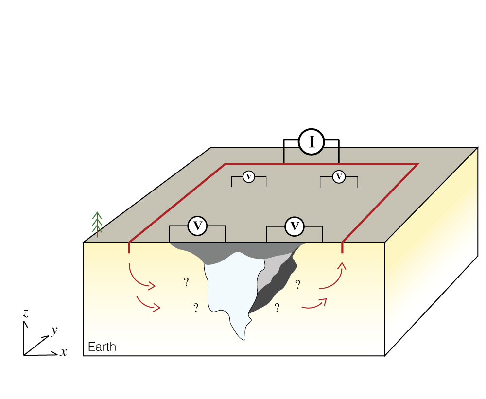
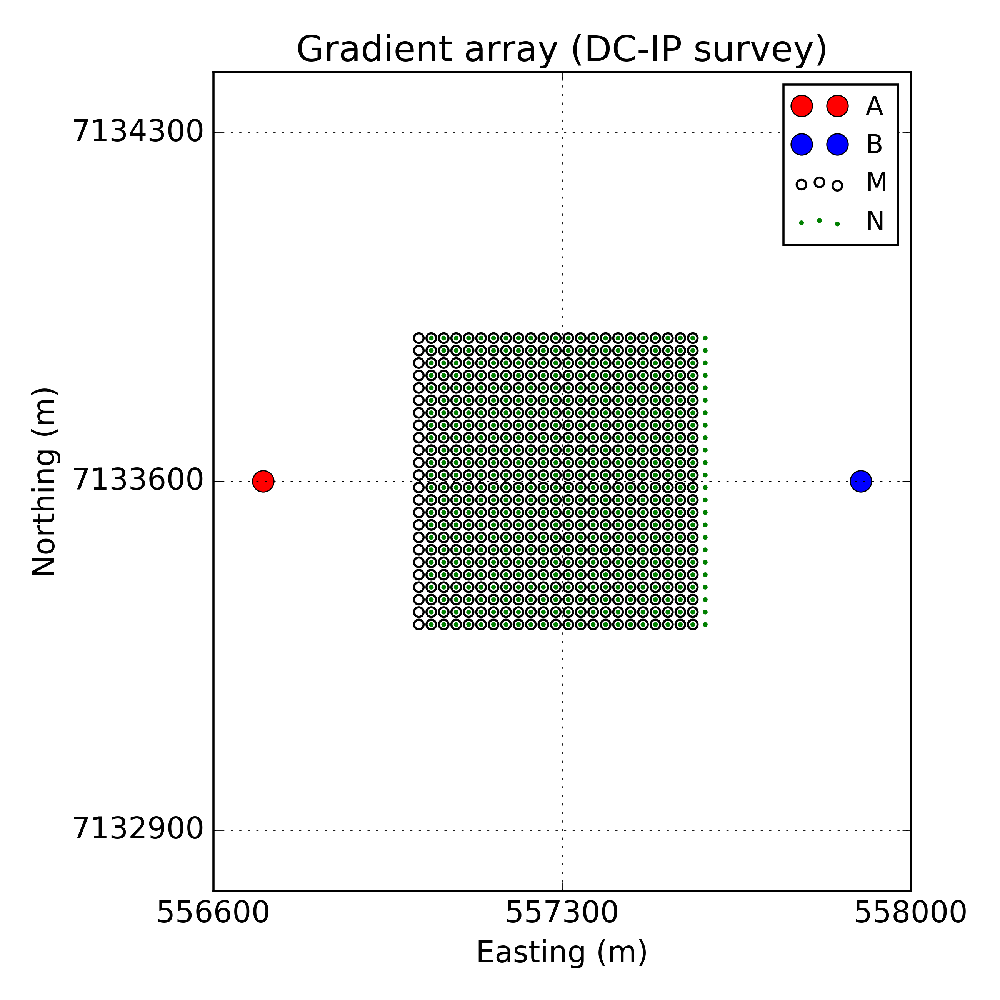
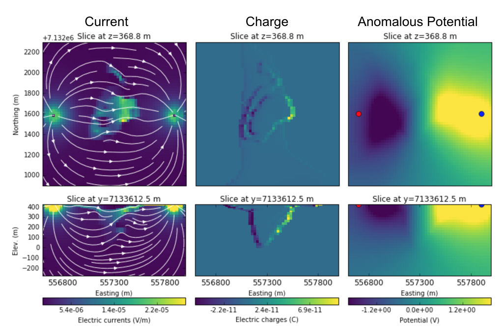

.. _TKC_DC_story:

DC resistivity
==============

.. topic:: Purpose

    Understand basic setup and physics of a direct current (DC) resistivity survey within the context of a kimberlite exploration. Run DC forward modelling and inversion using SimPEG-Static package.

Set-up
------

Physical behavior of DC resistivity survey is governed by steady-state Maxwell's equation:

.. math::
    \vec{j} = \sigma \vec{e}

.. math::
    \vec{e} = -\nabla \phi

.. math::
    \nabla \cdot \vec{j} = -\vec{j}_s = I_0 (\delta(\vec{r}-\vec{r}_+)-\delta(\vec{r}-\vec{r}_-))

.. math::
    \vec{j} \cdot \hat{n} \ \Big|_{\partial \Omega} = 0

- :math:`\vec{j}`: Current density (A/m :math:`^2`)

- :math:`\vec{e}`: Electric field (V/m)

- :math:`I_0`: Current (A)

- :math:`\delta`: Volumetric delta function (m :math:`^{-3}`)

Consider a simple gradient array having a pair of A (+) and B (+) current electrodes (Tx) with multiple M (+) and N (-) potential electrodes (Rx). Using giant battery (?), we make significant potential difference allowing electrical currents flow A to B electrodes. If the earth includes conductors or resistors that will distorts current flows, and measured potential differences on the surface electrodes (MN) will be reflective on those distortions. Typically kimberlitic pipe (including diamonds) will be more conductive than the background rock (granitic) hence, measured potential difference will be low. That is, contrasts in electrical conductivity between different rocks induce anomalous voltages. From the observed voltages, we want to estimate conductivity distribution of the earth. We use a geophysical inversion technique to do this procedure.

We work through each step of geophysical inversion using SimPEG-Static package under SimPEG's frame work having two main items: a) Forward simulation and b) Inversion.

.. figure:: images/SimPEGFramework.png
    :width: 80%
    :align: center
    :name: SimPEGFramework

    SimPEG's framework

Forward simulation
------------------

A forward simulation of DC requires Survey and Problem classes. We need to pass current and potential electrode locations to a DC survey class. Physical behavior of DC is governed by static Maxwell's equations, and a DC problem class handles this by solving a corresponding partial different equation in a discrete space. For this, the earth earth needs to be discretized to solve corresponding partial differential equation. The Problem class computes fields in full discretized domain, and the Survey class evaluates data at potential electrodes using the fields. The Survey and Problem classes need to share information hence, we pair them.

Mesh
****

We use a 3D tensor mesh to discretize the earth having 25x25x25 m core cell size.
Smaller vertical size of the cell (dz) is used close to the topographic surface (12.5 m), and padding cells are used to satisfies the natural boundary condition imposed.

.. plot::

    from SimPEG import Mesh, np
    # Core cell sizes in x, y, and z
    csx, csy, csz = 25., 25., 25.
    # Number of core cells in each directiPon s
    ncx, ncy, ncz = 48, 48, 20
    # Number of padding cells to add in each direction
    npad = 7
    # Vectors of cell lengthts in each direction
    hx = [(csx,npad, -1.3),(csx,ncx),(csx,npad, 1.3)]
    hy = [(csy,npad, -1.3),(csy,ncy),(csy,npad, 1.3)]
    hz = [(csz,npad, -1.3),(csz,ncz), (csz/2.,6)]
    # Create mesh
    mesh = Mesh.TensorMesh([hx, hy, hz],x0="CCN")
    # Map mesh coordinates from local to UTM coordiantes
    xc = 300+5.57e5
    yc = 600+7.133e6
    zc = 425.
    mesh._x0 = mesh.x0 + np.r_[xc, yc, zc]
    mesh.plotSlice(np.ones(mesh.nC)*np.nan, grid=True)
    mesh.plotSlice(np.ones(mesh.nC)*np.nan, grid=True, normal="Y")
    plt.gca().set_aspect('equal')
    plt.show()

Survey
******

We use a simple gradient array having a pair of current electrodes (AB), and multiple potential electrodes (MN).  The lengths of AB and MN electrodes are 1200 and 25 m, respectively.

    Gradient array

Once we have obtained locations of AB (Src) and MN (Rx) electrodes, we can generate **Survey** class:

.. code-block:: python

    from SimPEG.EM.Static import DC

    # Create Src and Rx classes for DC problem
    Aloc1_x = np.r_[-600., 0, 0.] + np.r_[xc, yc, zc]
    Bloc1_x = np.r_[600., 0, 0.] + np.r_[xc, yc, zc]

    # Rx locations (M-N electrodes, x-direction)
    x = mesh.vectorCCx[np.logical_and(mesh.vectorCCx>-300.+ xc, mesh.vectorCCx<300.+ xc)]
    y = mesh.vectorCCy[np.logical_and(mesh.vectorCCy>-300.+ yc, mesh.vectorCCy<300.+ yc)]
    # Grid selected cell centres to get M and N Rx electrode locations
    Mx = Utils.ndgrid(x[:-1], y, np.r_[-12.5/2.])
    Nx = Utils.ndgrid(x[1:], y, np.r_[-12.5/2.])

    rx = DC.Rx.Dipole(Mx, Nx)
    src = DC.Src.Dipole([rx], Aloc1_x, Bloc1_x)

    # Form survey object using Srcs and Rxs that we have generated
    survey = DC.Survey([src])

Fields and Data
***************

By solving the DC equations, we compute electrical potential (:math:`\phi`) at every cells. **Problem** class does this, but it still requires survey information hence we pair it to the **Survey** class:

.. code-block:: python

    # Define problem and set solver
    problem = DC.Problem3D_CC(mesh)

    problem.Solver = MumpsSolver
    # Pair problem and survey
    problem.pair(survey)

Here, we used ``DC.Problem3D_CC``, which means 3D space and :math:`\phi` is defined at the cell center. Now, we are ready to run DC forward modelling! For this modelling, inside of the code, there are two steps:

1. Compute fields (:math:`\phi` at every cells)
2. Evaluate at Rx location (potential difference at MN electrodes)

Consider two conductivity models:

- Homogeneous background below topographic surface: ``sigma0`` (:math:`10^{-4}` S/m)
- Includes diamond pipes: ``sigma`` (S/m)

.. code-block:: python

    # Read pre-generated conductivity model in UBC format
    sigma = mesh.readModelUBC("VTKout_DC.dat")
    # Identify air cells in the model
    airind = sigma == 1e-8
    # Generate background model (constant conductiivty below topography)
    sigma0 = np.ones_like(sigma)*1e-4
    sigma0[airind] = 1e-8

Then we compute fields for both conductivity models:

.. code-block:: python

    # Forward model fields due to the reference model and true model
    f0 = problem.fields(sigma0)
    f = problem.fields(sigma)

Now ``f`` and ``f0`` are **Field** objects including computed :math:`\phi` everywhere. However, this **Field** object know how to compute both :math:`\vec{e}`, :math:`\vec{j}`, and electrical charge, :math:`\int_V \rho_v dV` (:math:`\rho_v` is volumetric charge density). Note that if we know :math:`\phi`, all of them can be computed for a corresponding source:

.. code-block:: python

    phi = f[src, 'phi']
    e = f[src, 'e']
    j = f[src, 'j']
    charge = f[src, 'charge']

Since field object for the background model is generatec so, we can obtain secondary potential:

.. code-block:: python

    # Secondary potential
    phi0 = f0[src, 'phi']
    phi_sec = phi - phi0

We present plan and section views of currents, charges, and secondary potentials in numerefXXX`DCfields`.

    DC fields. Left, middle, and right panels show currents, charges, and secondary potentials.

Current flows from A (+) to B (-) electrode (left to right). Kimberlite pipe should be more conductive than the background considering more currents are flowing through the pipe (See distortions of the current path in the left panel).

Electrical charges (the middle panel) supports that the pipe is conductive since left and right side of the pipe has negative and positive charges, respectvely. In addition, charges only built on the boundary of the conductive pipe.

Secondary potential (the right panel) is important since it shows response from the kimberlite pipe, which often called "Anomalous potential". Usually, removing background response is a good way to see how much anomalous response could be obtained for the target.

On the other hand, we cannot measure those fields everywhere but measure potential differences at MN electrodes (Rx) hence we need to evalaute them from the fields:

.. code-block:: python

    # Get observed data
    dobs = survey.dpred(sigma, f=f)

If the field has not been computed then we do:

.. code-block:: python

    # Get observed data
    dobs = survey.dpred(sigma)

This will compute the field inside of the code then evaluate for data at Rx locations. Below image shows the computed DC data. Smaller potentials are obtained at the center locations, which implies the existence of conductive materials. Current easily flows with conductive materials, which means less potential is required to path through them, hence for resistive materials we get greater potential difference measured on the surface. The measured potential provides some idea of the earth; however, this is not enough, we want a 3D distribution of the conductivity!

.. figure:: images/dc/DCdata.png
    :align: center
    :width: 50%
    :name: DCdata

    DC data.

Inversion Elements
------------------

Our goal here is finding a 3D conductivity model, which explains the observed data shown in numerefXXX`DCdata`. Inversion elements (red box in numerefXXX`SimPEGFramework`) will handle this task with an ability to simluate forward problem. We go through each element and briefly explain.

Mapping
*******

For the simulation, we used 3D conductivity model defined in every cell center location. However, for the inversion we may not want to estimate conductivity at every cell. For instance, our domain include some air cells, and we already know well about the conductivity of the air (:math:`10^{-8} \approx 0`) hence, those air cell should be excluded from the inversion model, :math:`m`. Accordingly, a mapping is required moving from the inversion model to conductivity model defined at whole discrete domain:

.. math::
    \sigma  = \mathcal{M}(m)

In addition, conductivity varies logarithmically we often use log conductivity as our inversion model (:math:`m = log (\sigma)`). So, our inversion model is log conductivity only defined below the subsurface cells, and this can be expressed as

.. math::

    \sigma = \mathcal{M}_{exp}\Big(\mathcal{M}_{act} (m)\Big),

where :math:`\mathcal{M}_{act}(\cdot)` is a ``InjectActiveCells`` map, which takes subsurface cell and surject to full domain including air cells, and :math:`\mathcal{M}_{exp}(\cdot)` is an ``ExpMap`` map takes log conductivity to conductivity. Combination of two maps are required to get :math:`\sigma` from :math:`m`, which can be codified as

.. code-block:: python

    # from log conductivity to conductivity
    expmap = Maps.ExpMap(mesh)
    # from subsurface cells to full 3D cells
    actmap = Maps.InjectActiveCells(mesh, ~airind, np.log(1e-8))
    mapping = expmap*actmap

Generated mapping should be passed to **Problem** class:

.. code-block:: python

    # Generate problem with mapping
    problem = DC.Problem3D_CC(mesh, mapping=mapping)

Data Misfit
***********

Finding a model explaining the observed data requires a measure between observed (:math:`\mathbf{d}^{obs}`) and predicted data (:math:`\mathbf{d}^{dpred}`):

.. math::

    \phi_d = 0.5\| \mathbf{W}_d (\mathbf{d}^{pred}-\mathbf{d}^{obs})\|^2_2,

where :math:`\mathbf{W}_d = \mathbf{diag}( \frac{1}{\% | \mathbf{d}^{obs} |+\epsilon} )` is the data weighting matrix. Uncertainty in the observed data is approximated as :math:`\% | \mathbf{d}^{obs} |+\epsilon`.

.. code-block:: python

    # percentage and floor for uncertainty in the observed data
    std, eps = 0.05, 1e-3
    survey.std = std
    survey.eps = eps
    survey.dobs = dobs

    # Define datamisfit portion of objective function
    dmisfit = DataMisfit.l2_DataMisfit(survey)

Regularization
**************

Objective function includes both data misfit and regularization term, :math:`\phi_m` :

.. math::

    \phi = \phi_d + \beta \phi_m

We use Tiknov-style regularization including both smoothness and smallness terms. For further details of this See XXX.

In addition, considering the geometry of the gradient array: a single source and distributed receivers, this specific DC survey may not have much depth resolution similar to magnetic and gravity data. Depth weighting (:math:`\frac{1}{(z-z_0)^3}`) is often used to handle this. And with this weight we form **Regularization** class:

.. code-block:: python

    # Depth weighting
    depth = 1./(abs(mesh.gridCC[:,2]-zc))**1.5
    depth = depth/depth.max()

    # Define regulatization (model objective function)
    reg = Regularization.Simple(mesh, mapping=regmap, indActive=~airind)
    reg.wght = depth[~airind]
    reg.alpha_s = 1e-1
    reg.alpha_x = 1.
    reg.alpha_y = 1.
    reg.alpha_z = 1.

Optimization
************

To minimize the objective function, an optimization scheme is required. **Optimization** class handles this, and we use Inexact Gauss Newton Scheme CITExxx.

.. code-block:: python

    opt = Optimization.InexactGaussNewton(maxIter = 20)

InvProblem
**********

Both **DatamMisfit** and **Regularization** classes are created, and an **Optimiztion** is chosen. Still, they need to be declared as a minimization problem:

.. math::

    \text{minimize} \ \phi_d + \beta \phi_m \ \\
    s.t. \ \text{some constratins}

**InvProblem** class can be set with **DatamMisfit**,  **Regularization** and **Optimiztion** classes.

.. code-block:: python

    invProb = InvProblem.BaseInvProblem(dmisfit, reg, opt)

Inversion
*********

We have stated our inverse problem, but a conductor is required, who directs our inverse problem. **Directives** conducts our **Inversion**. For instance, the trade-off parameter, :math:`\beta` needs to be estimated, and sometimes cooled in the inversion iterations. A target misfit is need to be set usually upon discrepancy principle (:math:`\phi_d^\ast = 0.5 N_d`, where :math:`N_d` is the number of data).

.. code-block:: python

    # Define Directives
    betaest = Directives.BetaEstimate_ByEig(beta0_ratio=1e0)
    beta = Directives.BetaSchedule(coolingFactor=5, coolingRate=2)
    target = Directives.TargetMisfit()

    # Define Inversion class
    inv = Inversion.BaseInversion(invProb, directiveList=[beta, betaest, target])

Run
***

Now we all set. Initial model is assumed to be homogenous.

.. code-block:: python

    # Create inital and reference model (1e-4 S/m)
    m0 = np.ones(mesh.nC)[~airind]*np.log(1e-4)

    # Run inversion
    mopt = inv.run(m0)

Inversion reached to the target misfit, hence we fit the observed data.

.. figure:: images/dc/DCObsPred.png
    :align: center
    :width: 100%
    :name: DCObsPred

    Observed and Predicted DC data.

A 3D conductivity model is recovered and compared with the true conductivity model. A conductive pipe at depth is recovered!

.. figure:: images/dc/Cond3D.png
    :align: center
    :width: 80%
    :name: Cond3D

    True and recovered conductivity models.

.. _SimPEG: http://simpeg.xyz
